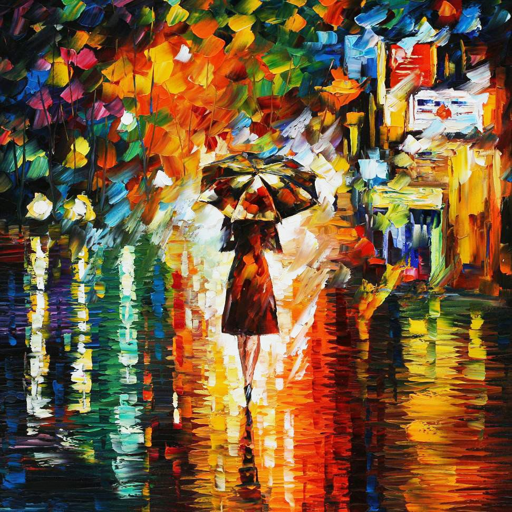

# real_styler
Телеграм бот для переноса стиля изображения: [@RTStyler](https://t.me/RTStyler_bot)

Датасет для обучения: https://www.kaggle.com/datasets/adityajn105/flickr8k

Имплементация работы [Perceptual Losses for Real-Time Style Transfer and Super-Resolution](https://arxiv.org/pdf/1603.08155.pdf).
Благодарен за семинары Анастасии Белозеровой и программе Ozon Masters

## В чем тут суть?

Мы заранее имеем одну картинку стиля, под которую будем выучивать сеть, и какую-то
выборку визуальных данных, которые можно использовать для обучения (разметки, конечно,
никакой нет).

Сеть мы хотим выучить так, чтобы какой бы ни был вход, после инференса преобразованная
картинка воспринималась как имеющая новый стиль. Вот это восприятие стиля картинки
и будет делать ImageNet-сетка, а такие навороты с восприятием контента и стиля
посредством маленького обученного ИИ назвали Perceptual Loss.

Лоссы тут на самом деле точно такие же, как в работе Гатиса - MSE между матрицами
Грама для стиля, MSE попиксельно для представления контента.

## Особенности
- Архитектура downsample-upsample. Вход и выход у нас одинакового размера. Понижать 
размерность вычислительно выгодно и так растет receptive field сверток.
- Нет pooling layers (для downsamle иcпользуем strided conv)
- Reflection padding перед conv всегда (чтобы не было артефактов на краях)
- Используются residual blocks
- Сразу используем Instance Normalization для улучшения качества, который был предложен
в работе [Instance Normalization: The Missing Ingredient for Fast Stylization](https://arxiv.org/pdf/1607.08022.pdf)
- Особый Upsample (чтобы не было шахматных артефактов применяем интерполяцию и конволюцию над ней)
- Для ускорения инференса не прибегаем к нормировке входного изображения, но нормируем батчи перед VGG16Loss

## Результаты
|   Input                           |  Style                      |  Result                                        |
|-----------------------------------|-----------------------------|------------------------------------------------|
|               |   |              |
|     |     |      |
|           |     |            |
| |     |  |

